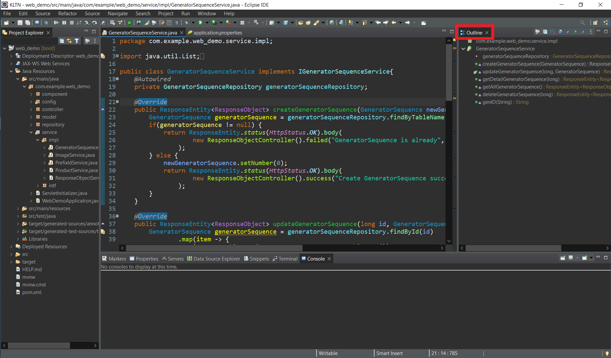

# COMMON ERRORS

## 1. Lỗi eclips bị treo mỗi khi chạy server
- Đọc file log của project đó để biết chi tiết về lỗi (file .log được đặt trong workspace/.metadata/.log)

### 1.1. Close Outline window 
- Tắt cửa sổ `Outline` góc phải trên



### 1.2. Start Eclipse -clean
- Tắt Eclipse nếu phần mềm đang được mở
- Mở thư mục chứa Eclipse.exe
- Tạo file `.bat` với nội dung
```
@echo off
start eclipse -clean
exit
```
Chạy file .bat này để mở eclipse (không mở bằng file Eclipse.exe)

### 1.3. Delete folder .metadata
- Tắt Eclipse nếu phần mềm đang được mở
- Mở thư mục chứa workspace
- Xóa thư mục `.metadata`
- Mở lại Eclipse để kiểm tra lỗi còn xuất hiện không

### 1.4. Switch workspace
- Tắt Eclipse nếu phần mềm đang được mở
- Tạo thư mục mới làm workspace
- Mở Eclipse chọn workspace mới này
- Tạo project mới và copy các file code cần thiết từ project cũ qua
- (hoặc switch workspace cũ)
- Kiểm tra lỗi còn xuất hiện hay không

### 1.5. Config folder eclipse.ini
- Tắt Eclipse nếu phần mềm đang được mở
- Mở thư mục chứa file cài đặt của eclipse
- Mở thư mục `eclipse.ini`
- Thêm dòng sau: (đường dẫn đến file jdk)
```
-vm
C:/Program Files/Java/jdk-17/bin/javaw.exe
```
- Thay đổi giá trị cho phù hợp
```
-Xms512m
-Xmx2048m
```